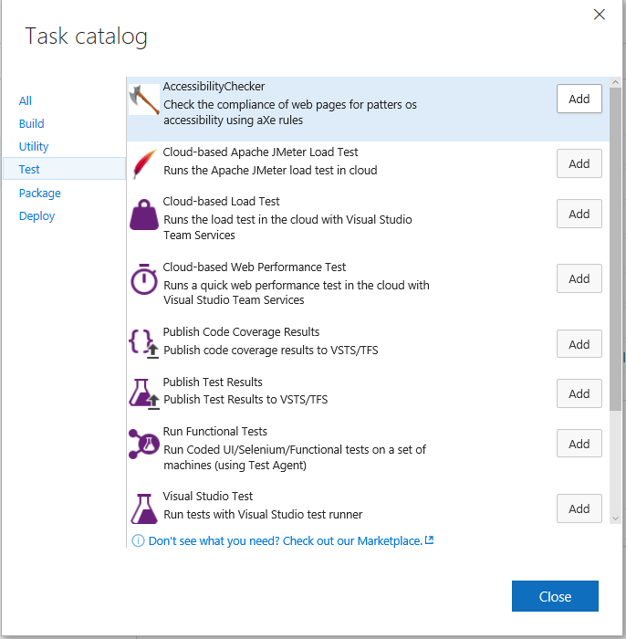
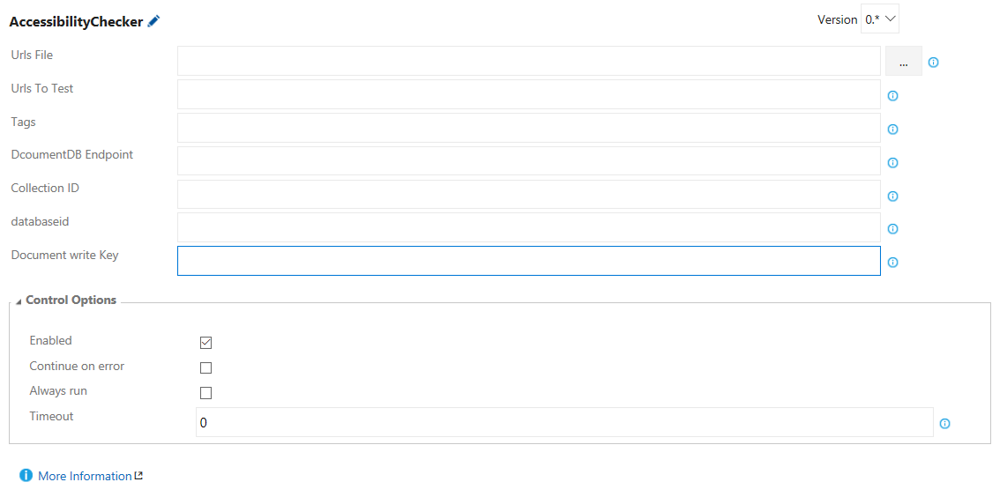

#Overview
This tasks use aXe rules to perform accessebility validation in the Release Pipeline using Visual Studio Team Services or Team Foundation Server.

#Requirements
* [Node.js](https://nodejs.org/)
* [tfx-cli](https://github.com/Microsoft/tfs-cli) 

#How to Install this Task
1. Clone this repo 
2. Open a command prompt and navigate to the repo root
3. Install npm pacages
`npm install
4. Upload task to TFS or VSTS
`tfx login
`tfx build tasks upload --task-path .   

#Using The Taks
1. In a Build or Release Definition, add a new Task

2. Select a file with the input of the URLs that you want to validate in "Urls File" OR type the list of comma separated URLs in "Urls to test"
3. Optionally type the tags to filter the rules to validate more info: [aXes Rules](https://github.com/dequelabs/axe-core/blob/master/doc/rule-descriptions.md)
4. Optionally type DcoumentDB Endpoint, Collection ID, Collection ID and Document write Key to save the results of the validation to a DocumentDB in Azure

#Analysing the Validation results
There is currently three possible ways to get the results of the validation:

1. The violations are showed in the log of the task. 
2. It is possible to download a json from the build artfacts.
3. It is possible to save the results to a DocumentDB database in azure 
    